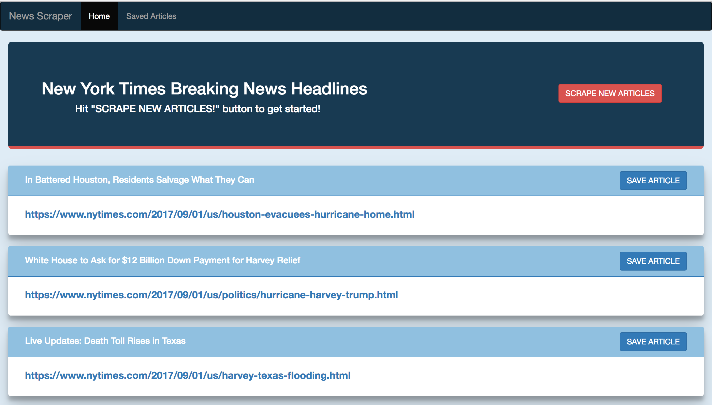
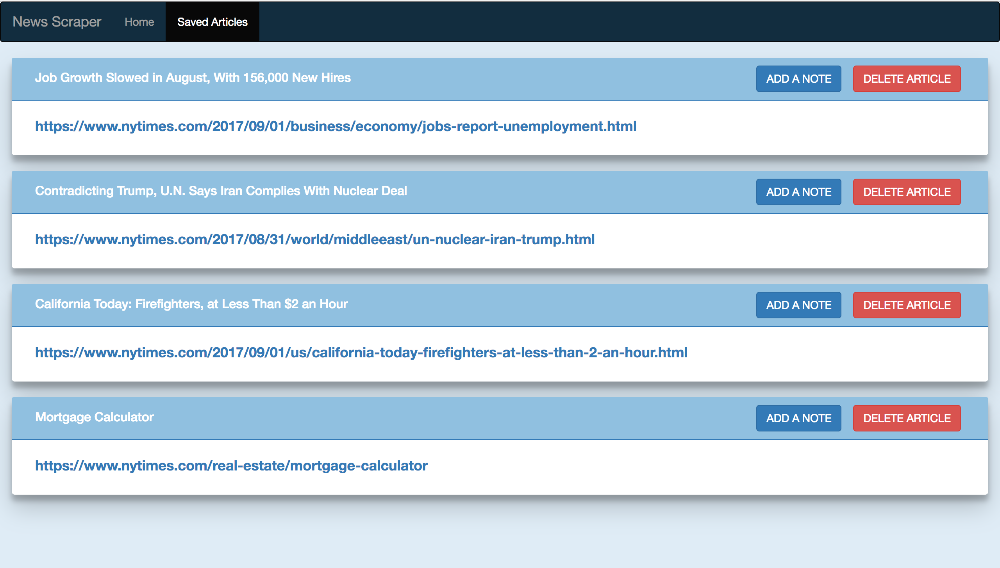
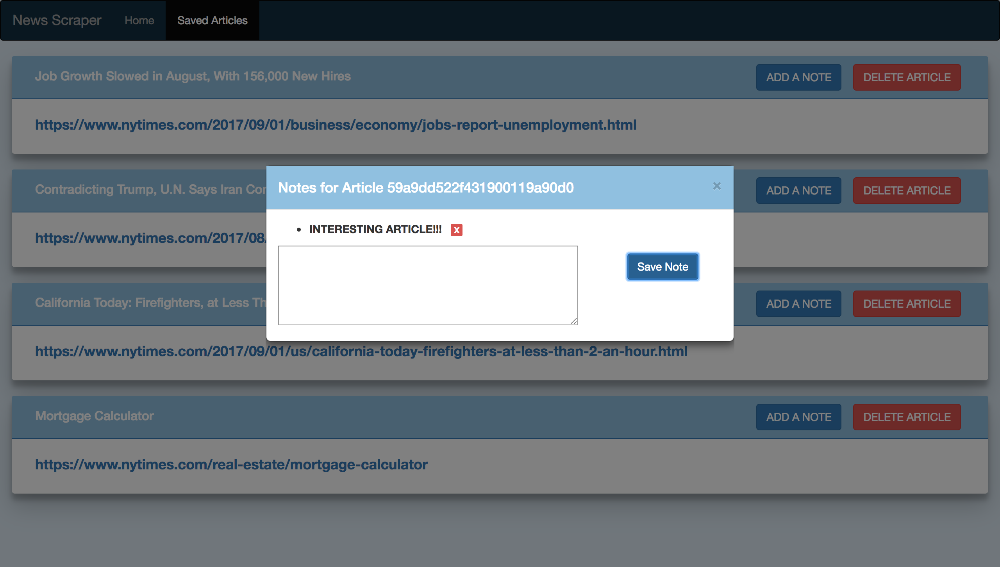

# Mongo News Scrapper

#### is an app that let users scrape news from NYT site, Save Articles for later times, Users can also Add, View and Delete notes from each Saved Article.

### View app live on [Heroku](https://mongo-news-scrapper.herokuapp.com/)

## Run locally
### Install dependencies
```shell
npm install
```
### Start the server
```shell
node server.js  OR  nodemon server.js
```
### Open a browser and go to [http://localhost:3000](http://localhost:3000)

## Tech
### Built with 

### ExpressJS, NodeJS, MongoDB, Mongoose, Handlebars and several npm
packages.


## Below Are some screen shots:






